Nama    : Muhammad Ferdi Herdiansyah

Kelas   : T I. 20 D1

NIM     : 312010038

Mata Pel: Pemograman Web

Dosen   : Agung Nugroho,S.Kom.,M.Kom.,

1. Membuat Box Elemen 

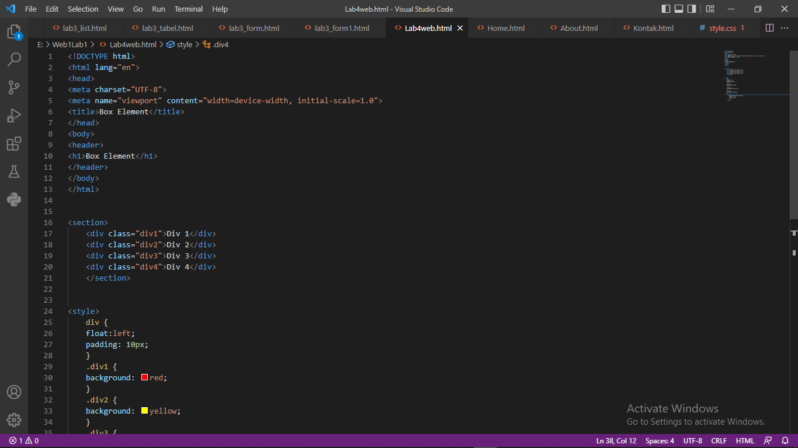
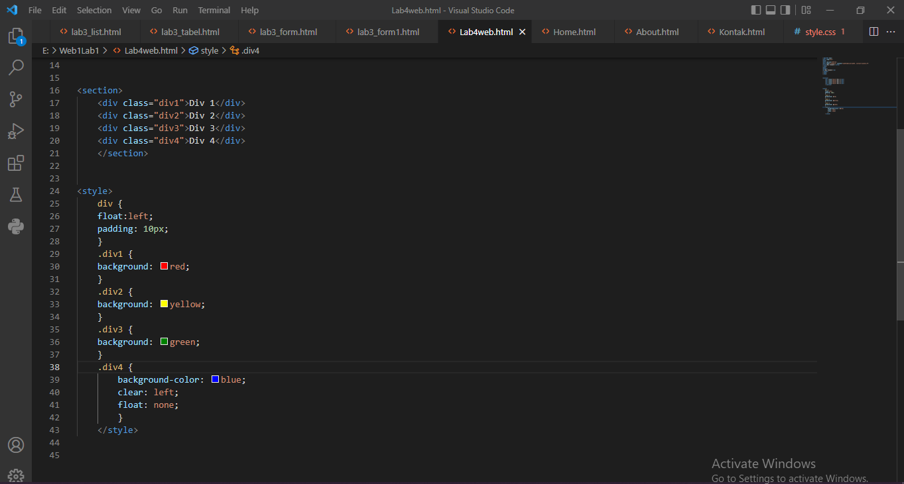
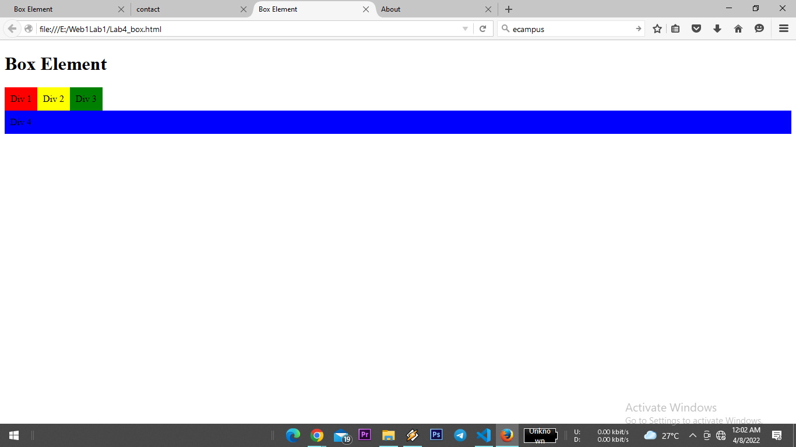

Mengatur Clearfix Element

Membuat Layout Sederhana

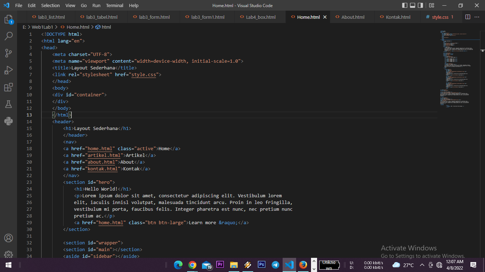
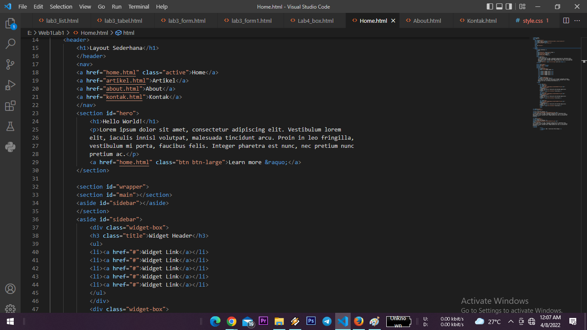

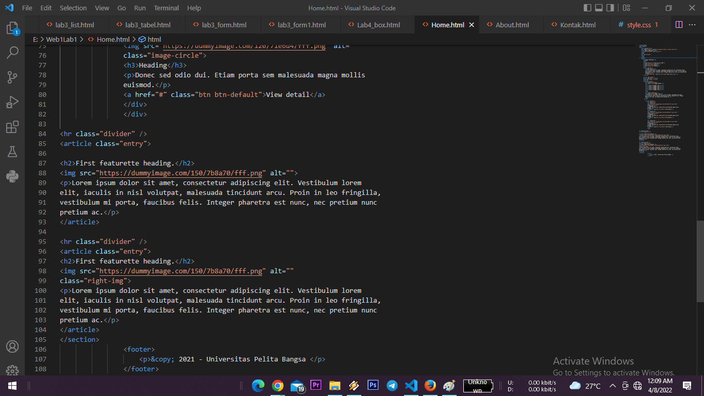
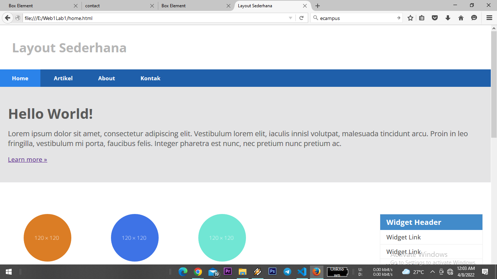

Membuat Sidebar Widget

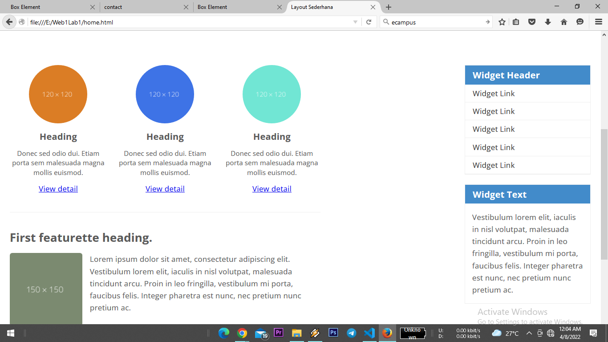

Mengatur Footer

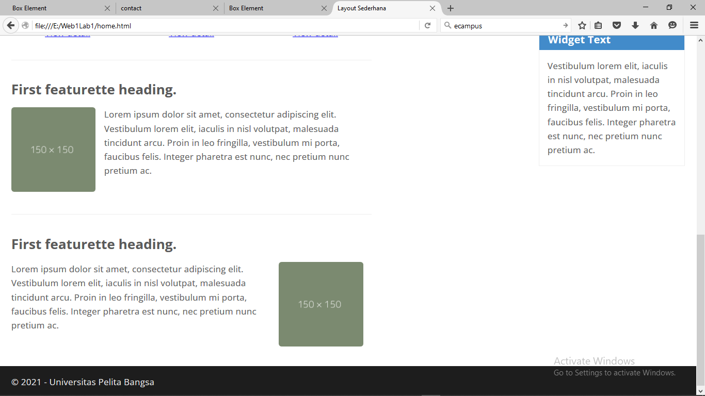

Menambahkan Elemen lainnya pada Main Content

Menambahkan Content Artikel

Tambahkan Layout untuk menu About
=> buat single layout yang berisi deskripsi, portfolio, dll

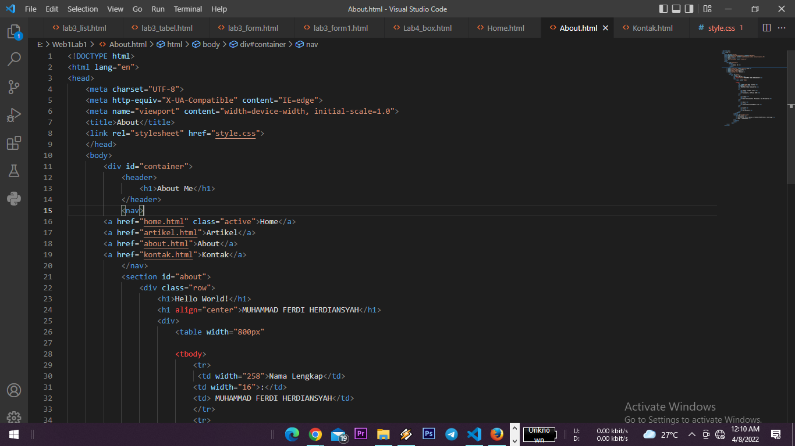

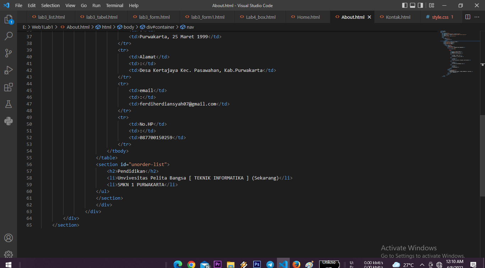
