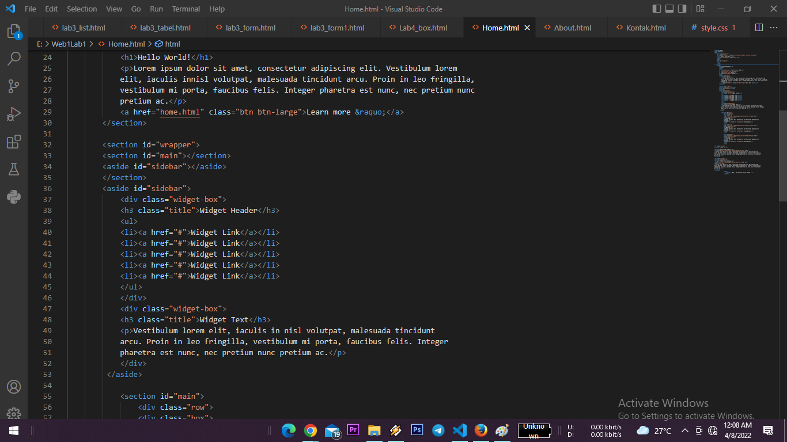

Nama    : Muhammad Ferdi Herdiansyah

Kelas   : T I. 20 D1

NIM     : 312010038

Mata Pel: Pemograman Web

Dosen   : Agung Nugroho,S.Kom.,M.Kom.,

1. Membuat Box Elemen 

Mengatur Clearfix Element

Membuat Layout Sederhana

